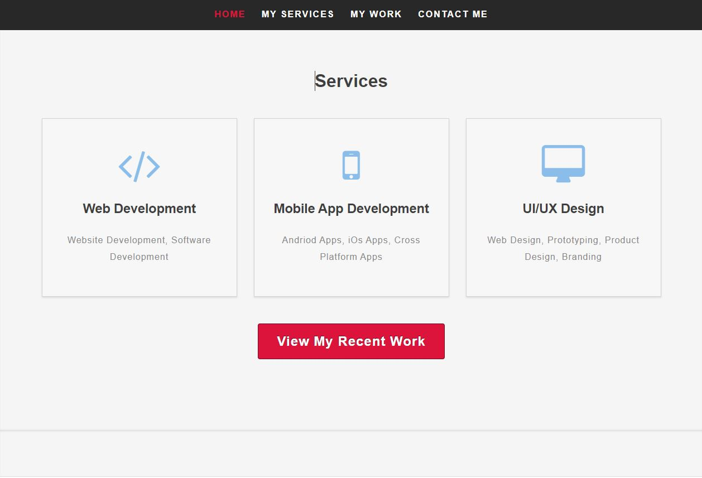

# OCHUKO EREWIVE WEBSITE

## User-Centric Frontend Development Milestone Project.

A website presenting Ochuko Erewive's Resume. Users will be able to find instresting content of work done in an easy and simple way.

This project is for educational purposes and can not be be used as a template for any personal use. Main aim is to build a responsive website with HTML and CSS only.

Bootstrap is used to make it clear and clean.

## Live website can be viewd in githup

#  UX

## Website Resume goals

The reason for this website is to create a Resume showcasing and selling your ability and talents of all the work you have done in the past years and also to convince any potential employer in search of a Full-Stack Developer in his/her reputable organisation. With this site, detailed past experienced work is displayed to measure one's ability.

USER GOALS

New User Goals:
+ User is able to find information about potential employee.
+ User is able to find past detailed work done.
+ User is able to see and notice the strength of potential employee.

Returning User Goals:
+ User can contact the potential employee via the form or any of the social media platforms.
+ User can learn more about the potential employee.

UER STORIES

As a business owner:
+ I would like to make myself well known in the world via the internet.
+ Mkae my information accessable to any potential business/employee.

As a new customer:
+ I will need to contact my business partner or my employee.
+ I need to check out new information or updates of business partner or employee.

As a returning customer:
+ I need to contact co-partner and also schedule meetings for future goal.
+ I would love to connect my business partner/employee to  someone else.

# Structure Of The Website

This website is user friendly  to all platforms; Desktop computer, Laptop computer, phones, Ipad, Iphones and tablets pc. Every aspect of the website is designed to achieve maximum user satisfaction.

# Wireframes
+ The wireframes were designed using corel-draw platforms. Below is the Ipad view and the mobile view of the website.

Ipad view

Mobile View

SURFACE

COLORS:
+ background color: #f7f7f7
+ Font color: #000
+ Font color: #3e3e3e
+ link Color: #DC143C

IMAGES:
+ Images used are original

## FEATURES
The website consist of four pages. Three are accessible from the navigation menu.

NAVIGATION BAR
+ The navigation bar is visible on the top of the website. It is responsive and will adapt to mobile devices.
### Navigation Scheme consist of the follow; 
+ Home
+ My Services
+ My Work
+ Contact Me

FOOTER:
The foot consist of the following pages;
+ facebook, twitter, linkedIn and youtube icon. All icon are linkable to the sign-up/home pages respectively.

# Home
+ Consister of a picture at the lefthand side and also a discribtion/title at the righthand side.

# My Services
+ Consist of applicant abilities and work efficient.

# My Work
+ Which consist of my recent work done and a little gallery display of company logos.

# Contact Me
The contact part consist of the form that requires , nammes, email address, asubject and a short message

## Technologies used:
* HTML File (.html)
* CSS File (.css)
* Bootstrap (.css)
* Font-Awesome (.css)
* Fonts (.ttf, .eot, .otf, .woff)
* Images (.png)
* Wireframe file (.jpg)

## 3rd party libraries
I used these third party libraries:
* [GOOGLE FONTS](http://fonts.googleapis.com/css?family=Open+Sans:300,400,600,700,800)

## TESTING
The site was tested in google chrom, mozilla and windows browsers.

# Compatibility testing
Site was tested across multiple virtual mobile devices and bowsers.

Tested also on hardware devices, on Dell pc and Hp pc.

# Performace testing

Code Validation

+ W3C CSS Validator to validate CSS
+ Nu Html Checker to test HTML

#  Deployment
This project was deployed in  GitHub which Gitpod is the development environment used.
I used git command to save all changes into GitHub.

To ply the project,
+ Log into GitHub and click on (MSPROJECT)
+ From the settings in GitHub, scroll down a little to the bottom of the page wher you will see "GitHub Pages.
+ from there you will see the repository address: https://ochukoerewive.github.io/msproject/

CREDITS
+ Code Institude student template was used to achieve my MS Project 1

Ideas and knowledge library:
+ w3schools.com
+ css-tricks.com
+ getbootstrap.com 

## Screen Shots

With this, i hope you can nevigate through the site

# Thank you
